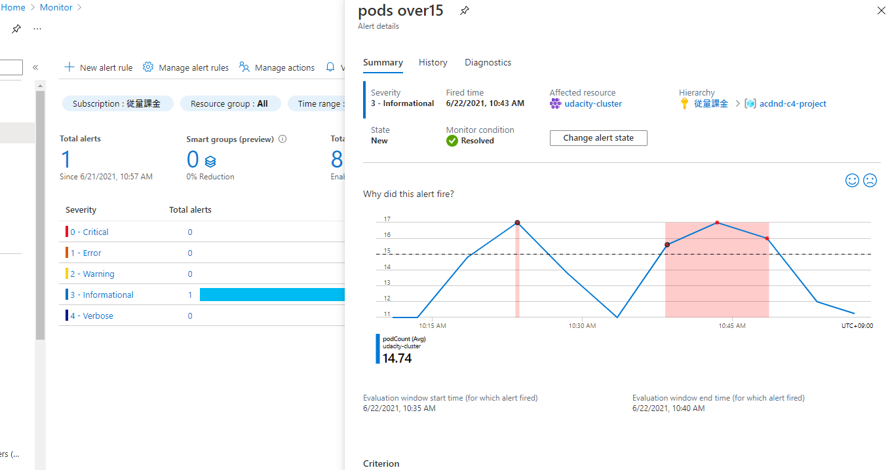
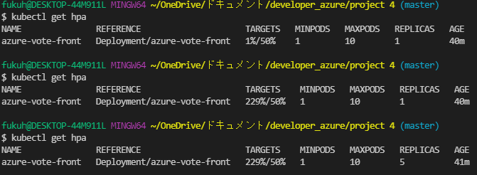
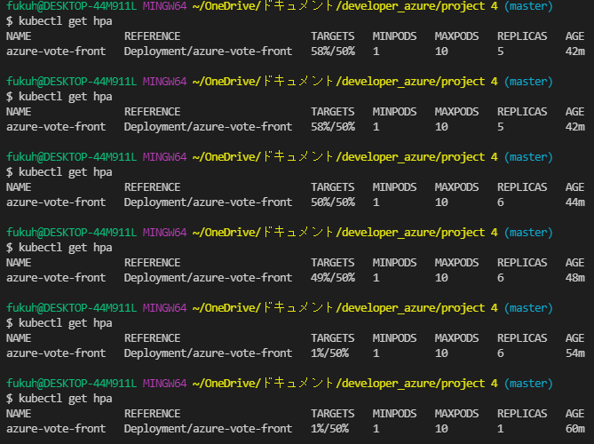
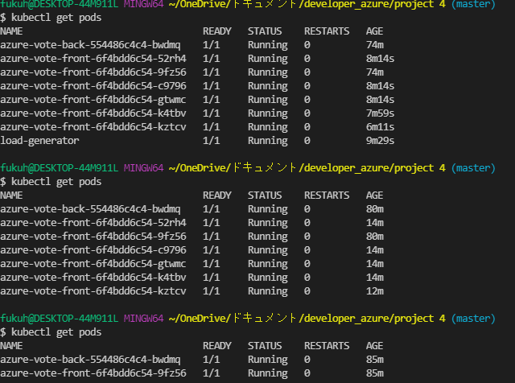
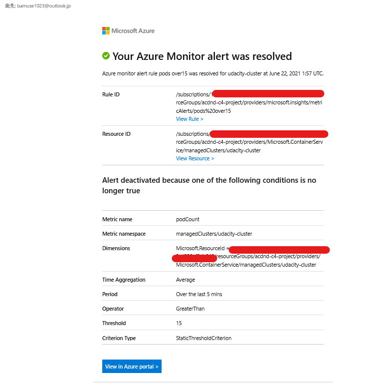

# Kubernetes Cluster Screenshots

Please the required screenshots for Kubernetes Cluster in this directory.

https://qiita.com/kenakamu/items/af537527d4d899a8f80e

https://docs.microsoft.com/en-us/azure/aks/tutorial-kubernetes-prepare-app

 kubectl run -i --tty load-generator --rm --image=busybox --restart=Never -- //bin/sh -c "while sleep 0.001; do wget -q -O- http://20.99.129.44/; done"

