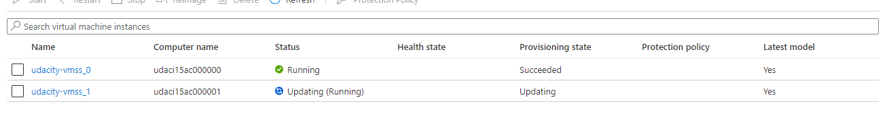
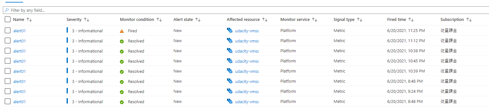
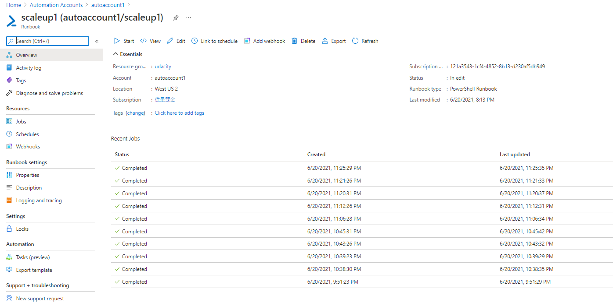
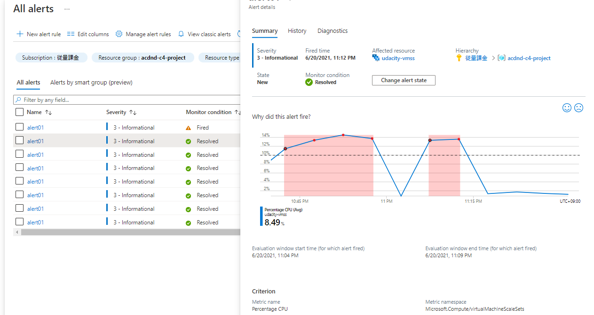

# RunBook Screenshots

## The summary of the alert which shows 'why did this alert fire?', timestamps, and the criterion in which it fired.

Arātorūru no kondishon de” Whenever the average percentage cpu is greather zan 10-pāsento” ga teigi sa rete ori, CPU no fuka ga takaku naru to mēru ni yoru tsūchi to Runbook ga kidō suru. RunBook wa suichoku sukēringu ga jikkō sa reru.
146 / 5000
翻訳結果
In the condition of the alert rule
"Whenever the average percentage cpu is greather than 10%" is defined, and an email notification and runbook will be launched when the CPU load is high. RunBook is vertically scaled. 

